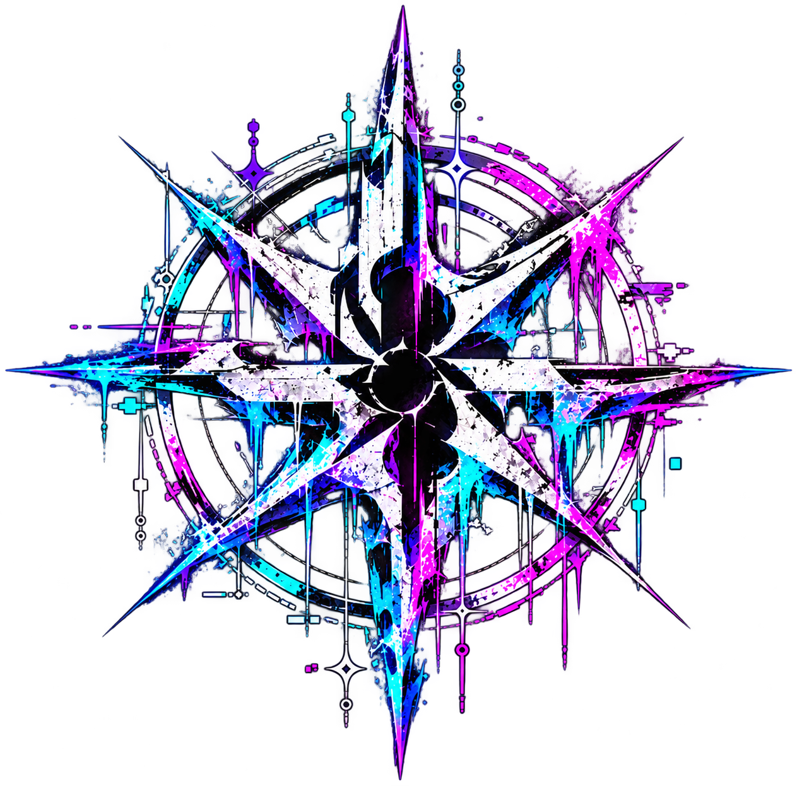

  

<h1 align="center">SEGFAULT SOCIETY</h1>

  Independent cybersecurity collective focused on research, security, CTFs, and open-source projects.

  <b>Research · Build · Learn · Share</b>

---

## About

Segfault Society is an independent cybersecurity collective founded in 2026.

We explore cybersecurity through hands-on research, experimentation, Capture the Flag competitions, open-source tooling, and technical knowledge sharing.

The Society is built around a simple idea:

> Learn by doing. Build by breaking. Share what you learn.

---

## Focus

- 🔬 Security Research
- 🧪 Security Experimentation
- 🏴‍☠️ Capture the Flag
- 🛠️ Open-Source Security Tools
- 🌐 Web & Application Security
- 🔍 Vulnerability Research
- 📚 Technical Writeups

---

## Projects

Our repositories contain tools, experiments, research, and other projects developed under Segfault Society.

New work will be published here as the collective grows.

---

## Research & Writeups

We document interesting findings, experiments, CTF challenges, and lessons learned whenever possible.

Knowledge is more useful when it is shared.

---

## CTF

We participate in Capture the Flag competitions to develop practical security skills and challenge ourselves against real-world style problems.

---

## Principles

**Learn.**  
Keep learning beyond the classroom.

**Research.**  
Question how systems work and investigate them responsibly.

**Build.**  
Turn ideas into tools and working projects.

**Share.**  
Document knowledge so others can learn from it.

**Responsibility.**  
Security research should be conducted lawfully and responsibly.

---

## Connect

Instagram: **@segfault_society**

---

  Founded 2026 · Independent Cybersecurity Collective

